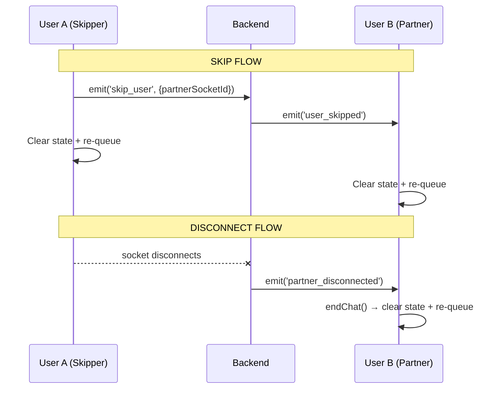

# Omegle/Monkey Style Skip & Disconnect

Implement reliable skip and disconnect behavior so both users are always returned to the waiting screen when one user skips or disconnects.

## Current Event Flow (Already Working)



> [!IMPORTANT]
> The architecture is correct and works. The issues are specific bugs in the handlers, not missing events.

## Proposed Changes

### Frontend — Chat.jsx

---

#### [MODIFY] [Chat.jsx](file:///c:/Users/nikhi/Downloads/joi/flinxx/frontend/src/pages/Chat.jsx)

**Bug 1**: [endChat()](file:///c:/Users/nikhi/Downloads/joi/flinxx/frontend/src/pages/Chat.jsx#3651-3677) (line 3651) is missing `setVideoChatStarted(false)`. When partner disconnects, [endChat()](file:///c:/Users/nikhi/Downloads/joi/flinxx/frontend/src/pages/Chat.jsx#3651-3677) is called but `videoChatStarted` stays `true` — the render logic may show stale UI.

```diff
 const endChat = () => {
   setHasPartner(false);
   setPartnerFound(false);
+  setVideoChatStarted(false);
   setIsConnected(false);
```

**Bug 2**: `partner_disconnected` handler (line 2577) redundantly closes PeerConnection and resets remote video before calling [endChat()](file:///c:/Users/nikhi/Downloads/joi/flinxx/frontend/src/pages/Chat.jsx#3651-3677) which does the same thing. This is harmless but messy. More importantly, it should show a brief "Partner disconnected" toast.

**Bug 3**: No WebRTC `connectionState` monitoring. If the network drops but the socket stays alive briefly, the partner won't know for several seconds. Adding a [connectionstatechange](file:///c:/Users/nikhi/Downloads/joi/flinxx/frontend/src/pages/Chat.jsx#1857-1955) listener on `RTCPeerConnection` gives instant detection.

**Consolidation**: Create a `resetToWaiting()` helper to eliminate the duplicated state-reset code across `skipUser`, `user_skipped` listener, `partner_disconnected` handler, and [endChat](file:///c:/Users/nikhi/Downloads/joi/flinxx/frontend/src/pages/Chat.jsx#3651-3677).

---

### Backend — server.js

---

#### [MODIFY] [server.js](file:///c:/Users/nikhi/Downloads/joi/flinxx/backend/server.js)

**Bug 4**: The `disconnect` handler (line 4850) uses `partnerSockets.get(socket.id)` to find the partner. But `partnerSockets` is only populated by the WebRTC relay handlers (`webrtc_offer`, `webrtc_answer`, `ice_candidate`). If a user disconnects *before* WebRTC signaling completes (e.g., during the waiting screen or right after `partner_found`), `partnerSockets` has no entry → partner is never notified.

**Fix**: Also populate `partnerSockets` from [matchingHandlers.js](file:///c:/Users/nikhi/Downloads/joi/flinxx/backend/sockets/matchingHandlers.js) when `partner_found` is emitted, so the mapping exists from the moment the match is made.

---

### Backend — matchingHandlers.js

---

#### [MODIFY] [matchingHandlers.js](file:///c:/Users/nikhi/Downloads/joi/flinxx/backend/sockets/matchingHandlers.js)

Store partner socket IDs in `partnerSockets` map (from server.js) at match time, not just at WebRTC signaling time. This requires exporting `partnerSockets` or passing it as a parameter.

## Verification Plan

### Manual Verification

> [!NOTE]
> No existing test files were found in the project (only node_modules test files). All verification is manual.

**Test Setup**: Open two browser tabs at `http://localhost:3003`, logged in as different users.

**Test 1 — Skip Flow**:
1. Both users click "Start Video Chat" → both enter waiting screen
2. Both get matched → video chat screen appears
3. User A clicks the "Skip" button (▶| icon, bottom-right)
4. **Expected**: Both User A AND User B return to the waiting screen
5. **Expected**: Both users are re-queued for a new match
6. **Expected**: If both are the only users, they should re-match within seconds

**Test 2 — Tab Close Disconnect**:
1. Both users match and enter video chat
2. User A closes their browser tab entirely
3. **Expected**: User B sees the waiting screen (re-queued automatically)
4. **Expected**: No error or crash on User B's side

**Test 3 — Network Drop (optional)**:
1. Both users match and enter video chat  
2. User A opens DevTools → Network tab → toggle "Offline"
3. **Expected**: User B detects disconnect within ~5 seconds
4. **Expected**: User B returns to waiting screen

**Verify via Console Logs**:
- User A skip → look for `⏭️ [SKIP] skip_user event emitted` in User A's console
- User B → look for `⏭️❌ PARTNER SKIPPED` in User B's console
- Tab close → look for `🔴 PARTNER DISCONNECTED EVENT RECEIVED` in remaining user's console
